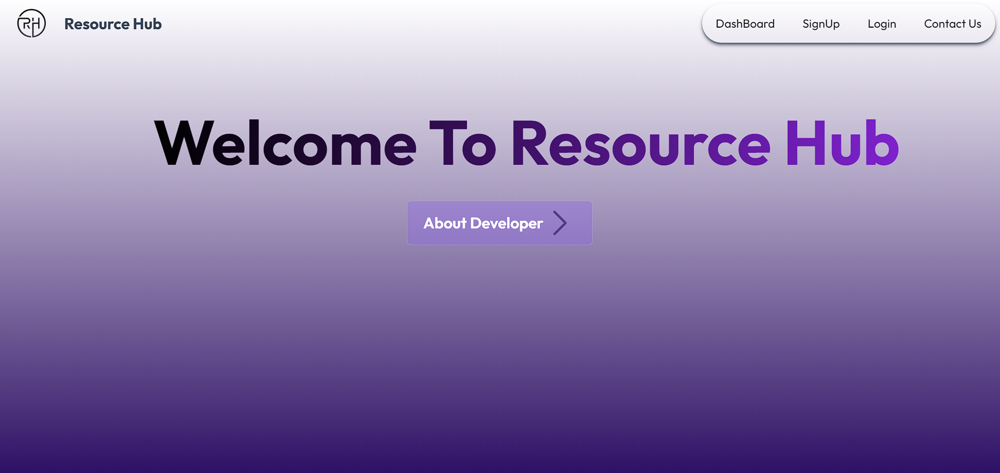
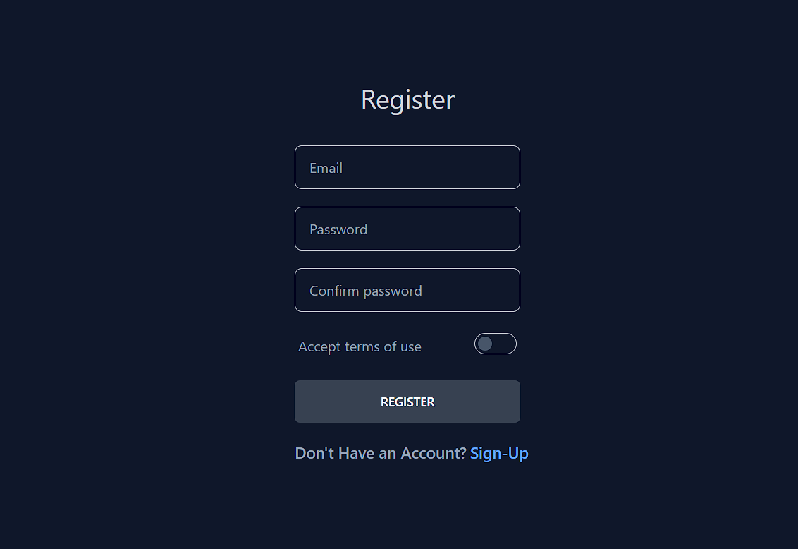
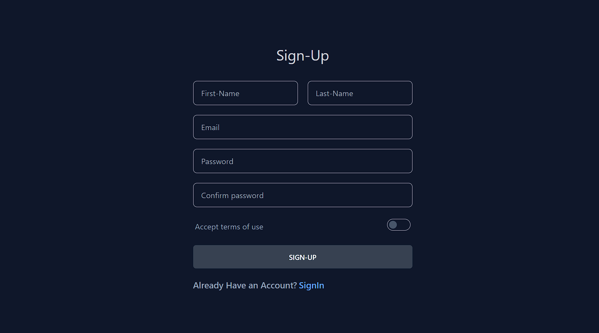

# Resource Hub

Welcome to the Resource Hub project! This application is designed to allow users to share and access various resources.


_Home Page_

_Login Page_

_SignUp Page_

## Features

- User authentication and authorization
- Resource sharing and management
- Responsive design for all devices
- Backend API with Node.js, Express, PostgreSQL, Zod, and Prisma

## Technologies Used

### Frontend

- React
- Tailwind CSS
- React Router

### Backend

- Node.js
- Express
- PostgreSQL
- Prisma
- Zod

## Project Structure

project-root/
├── backend/
│ ├── src/
│ │ ├── controllers/
│ │ ├── models/
│ │ ├── routes/
│ │ ├── services/
│ │ └── app.js
│ ├── prisma/
│ │ ├── schema.prisma
│ │ └── migrations/
│ ├── .env
│ ├── package.json
│ └── README.md
├── frontend/
│ ├── public/
│ ├── src/
│ │ ├── components/
│ │ ├── pages/
│ │ ├── App.js
│ │ ├── index.js
│ ├── .env
│ ├── package.json
│ └── README.md
├── .gitignore
├── README.md
└── package.json

## Setup Instructions

### Prerequisites

- Node.js (v14 or higher)
- PostgreSQL
- npm or yarn

### Cloning the Repository

```bash
git clone https://github.com/yourusername/resource-hub.git
cd resource-hub

```
