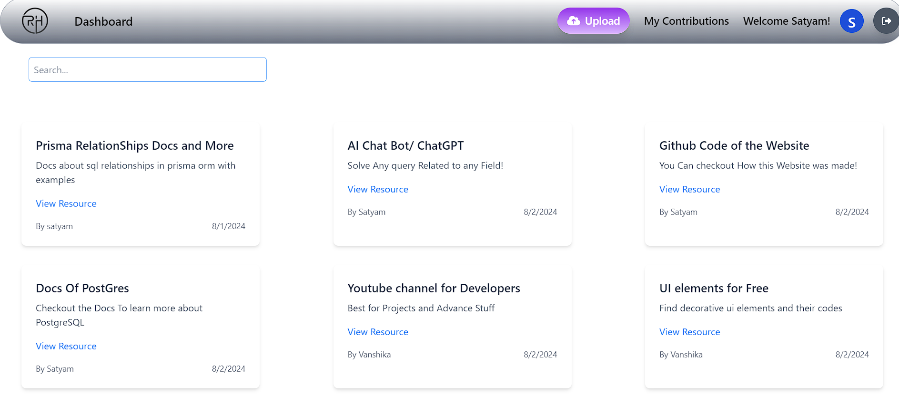

# Resource Hub

Welcome to the Resource Hub project! This application is designed to allow users to share and access various resources.


_Home Page_

_SignUp Page_

_Dashboard Page_

_Upload Page_

_Contributions Page_

## Features

- User authentication and authorization
- Resource sharing and management
- Responsive design for all devices
- Backend API with Node.js, Express, PostgreSQL, Zod, and Prisma

## Technologies Used

### Frontend

- React
- Tailwind CSS
- React Router

### Backend

- Node.js
- Express
- PostgreSQL
- Prisma
- Zod

# Project Structure

````plaintext
project-root/
├── server/
│   ├── prisma/
│   │   ├── migrations/
│   │   ├── schema.prisma
│   ├── src/
│   │   ├── prisma.ts/
│   ├── Routes/
│   │   ├── index.js/
│   │   ├── Resource.js/
│   │   ├── User.js/
│   ├── zod/
│   │   ├── zod.js/
│   ├── middleware/
│   │   ├── middleware.js/
│   ├── index.js/
│   │
├── client/
│   ├── public/
│   │   ├── index.html
│   ├── src/
│   │   ├── components/
│   │   ├── pages/
│   │   ├── App.js
│   │   ├── index.js
│   └── tailwind.config.js
├── .gitignore
├── README.md
└── package.json


## Setup Instructions

### Prerequisites

- Node.js (v14 or higher)
- PostgreSQL
- npm or yarn

### Cloning the Repository

```bash
git clone https://github.com/yourusername/resource-hub.git
cd resource-hub

````
